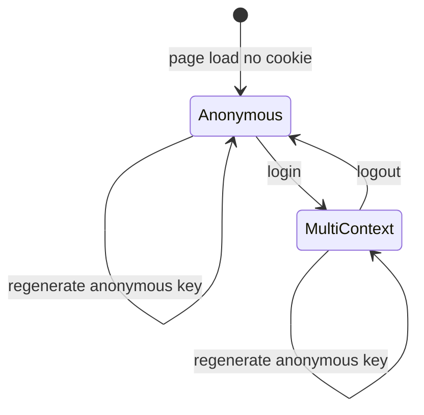

# LD Context Demo — Architecture Reference

Agent-oriented overview of the demo app. Live deployment: https://ld-context-demo.vercel.app/

## Purpose

Public LaunchDarkly demo for **context management** and **feature flag evaluation**. Used in recordings, workshops, and sales demos to show:

- Multi-context identity (user + anonymous)
- Attribute-based targeting (`customerStatus`, private `email`)
- Real-time flag evaluation with reasons
- Observability and session replay via LD plugins

## LaunchDarkly project

| Setting | Value |
|---------|-------|
| Project key | `context-management-demo` |
| Client-side ID env var | `REACT_APP_LD_CLIENT_ID` (in `.env` / Vercel) |
| Code references | GitHub Action syncs `durw4rd/ld-context-demo` on push |

## Context lifecycle



### Anonymous (logged out)

```json
{
  "kind": "anonymousUser",
  "key": "<uuid from sessionStorage>",
  "anonymous": true
}
```

### Logged in (multi-context)

```json
{
  "kind": "multi",
  "user": {
    "key": "<username>",
    "name": "<username>",
    "email": "<username>@example.com",
    "customerStatus": "gold | bronze",
    "_meta": { "privateAttributes": ["email"] }
  },
  "anonymousUser": {
    "key": "<uuid>",
    "anonymous": true
  }
}
```

### Demo conventions

- Any username/password works for login (no real auth).
- Username **`Michal`** → `customerStatus: "gold"`; all others → `"bronze"`.
- Email is synthetic: `{username}@example.com`, marked private so it is not sent in LD event payloads.
- Anonymous user key persists in `sessionStorage` (`ld_anonymous_user_key`) across reloads.
- Logged-in user persists via `js-cookie` (`user`, 1-day expiry).

## Feature flags in code

| Flag key | Type | UI effect |
|----------|------|-----------|
| `releaseShinyBanner` | boolean | Fixed promo banner at top |
| `showNewsletterSignup` | boolean | Newsletter signup bar |
| `createUserButtonColour` | string | `"red"` → danger button; else success |
| `appLogo` | string | Header accent icon: `moon`, `star`, or `rocket` (default) |

All flags are listed in `AllFlagsDisplay` with values and evaluation reasons.

## SDK configuration

Initialized in [`src/main.jsx`](src/main.jsx) via `asyncWithLDProvider`:

| Option | Value | Purpose |
|--------|-------|---------|
| `bootstrap` | `"localStorage"` | Offline / fast startup from cached flags |
| `evaluationReasons` | `true` | Expose why each flag evaluated |
| `sendEventsOnlyForVariation` | `true` | Send analytics only when flags are evaluated |
| `timeout` | `5` | Init timeout (seconds) |
| `application.id` | `"ld-context-demo"` | Application metadata |
| `application.version` | `"1.0"` | Matches observability plugin version |

### Plugins

| Plugin | Package | Notes |
|--------|---------|-------|
| `FlagOverridePlugin` | `@launchdarkly/toolbar/plugins` | Dev flag overrides |
| `EventInterceptionPlugin` | `@launchdarkly/toolbar/plugins` | Dev event inspection |
| `Observability` | `@launchdarkly/observability` | Errors, logs, traces |
| `SessionReplay` | `@launchdarkly/session-replay` | Session recording (`privacySetting: strict`) |

LD Toolbar (`useLaunchDarklyToolbar`) is enabled only when `import.meta.env.DEV` is true.

## Key files

| File | Responsibility |
|------|----------------|
| [`src/main.jsx`](src/main.jsx) | SDK init, default context from cookie, plugin registration |
| [`src/App.jsx`](src/App.jsx) | Login/logout, `identify()` calls, context display, promotional UI |
| [`src/components/AllFlagsDisplay.jsx`](src/components/AllFlagsDisplay.jsx) | All flags table with `variationDetail()` reasons |
| [`src/index.css`](src/index.css) / [`src/App.css`](src/App.css) | LaunchDarkly 2026 brand tokens and component styles |
| [`src/brand/tokens/`](src/brand/tokens/) | Vendored LD design tokens (colors, Tailwind preset) |
| [`.github/workflows/action.yml`](.github/workflows/action.yml) | Code references sync on push |
| [`.launchdarkly/coderefs.yaml`](.launchdarkly/coderefs.yaml) | camelCase flag key aliases |

## Deployment

- **Host**: Vercel (`https://ld-context-demo.vercel.app/`)
- **Branch**: `main` on `durw4rd/ld-context-demo`
- **Build**: `npm run build` (Vite → `dist/`)

## Dead / unused code

- [`src/utils/firebaseConfig.js`](src/utils/firebaseConfig.js) — Firebase config exists but is not imported anywhere.

## Code references setup

Already configured in-repo. Manual verification:

1. GitHub repo secret `LD_ACCESS_TOKEN` with write access to `code-reference-repository`
2. Confirm project key `context-management-demo` matches the LD project
3. Push to `main` and verify the Actions workflow succeeds
4. In LD UI → flag → Code references, confirm repo links appear
